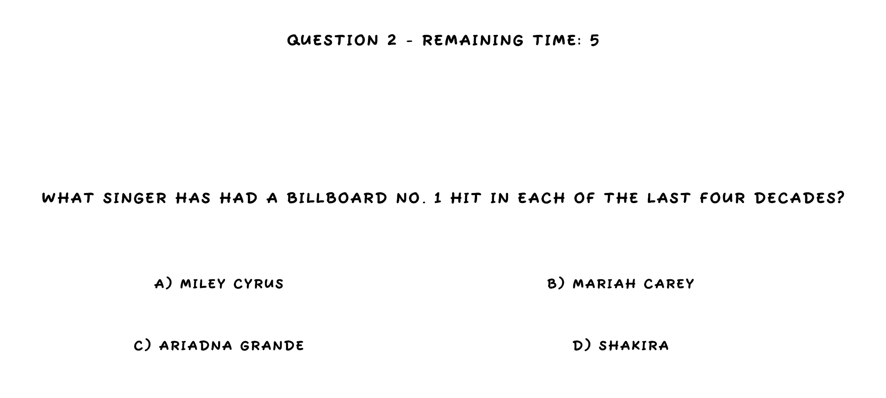

  <h1>🧩 Sense Quiz</h1>
  

  
  

  📥 <a href="https://github.com/iivvaannxx/sense-quiz/releases/tag/1.0.0">Download</a>
  &nbsp;·&nbsp;
  🔑 <a href="https://github.com/iivvaannxx/sense-quiz?tab=GPL-3.0-1-ov-file">License</a>
  

  
  
  
  
  

> [!IMPORTANT]
> The game uses a TextToSpeech library that only works on Android devices, if you open this project in the Unity Editor and try to play it, you won't hear any voice and it probably won't work as expected, because the game expects touch inputs to be used.

## ⚠️ Disclaimer

This game was created as a project for a college subject. The main objective was **to create a game playable by people with visual impairments or blindness**. Feel free to download and play it, but keep in mind that it's a bit slow-paced and simple. If you're an anxious or impatient person, and you're not interested in the accessibility aspect, you might not enjoy it.

Also, if you're a developer looking at the code, be aware that is quite the spaghetti code, don't judge me 😆, I was quite a noob when I wrote this.

## 📖 Introduction

The game consists of a quiz of 10 questions, each one with 4 possible answers. There are 7 different categories of questions, and the player can choose which one to play. The game has a narrator that reads the questions and answers, and the player can choose the answer by touching the screen. 

## 🛠️ Installation

The game is not distributed on the Google Play Store, so you need to manually download and install the `.apk` file on your Android device. Here is a step-by-step guide on how to do it:

1. Download the game from the [releases page](https://github.com/iivvaannxx/sense-quiz/releases/tag/1.0.0).
2. Copy the `.apk` file to your Android device.
3. Open the file manager on your device and navigate to the folder where you copied the `.apk` file.
4. Tap on the `.apk` file to start the installation process. If you get a warning about installing apps from unknown sources, you need to allow it in the settings.
5. Follow the instructions on the screen to install the game.
6. Once the installation is complete, you can open the game from the app drawer.

## 🎮 How to Play

### Controls

The controls are very simple, every time the narrator finished reading something and expects some kind of input, you will feel a small vibration on your device. That's the signal that you can touch the screen to choose an answer or to acknowledge the narrator's instructions/speech. Via audible feedback, you will know if your touch was sucessfully detected or not (if it is, you will hear a slight "confirmation" sound effect).

### Welcome

When you open the game you will be greeted by the narrator, who will introduce the game and ask you to touch the screen to continue. After that, it will read a (quite long) text explaining the game's objective and how to play it. You can touch the screen at any time to skip this text and go to the next part of the game.

### Configuration

The first part of the game consists on configurating the game, by selecting the desired category of questions and the time limit for each question. These are the options:

- **Category**: Choose one of the 7 categories of questions. They can be:

  - Art
  - Sports
  - History
  - Science
  - Geography
  - Entertainment
  - Mixed (Multiple categories)

- **Time Limit**: Choose the time limit for each question. The options are:

  - 5 seconds
  - 10 seconds
  - 20 seconds
  - 30 seconds

When you have a multiple-choice question, like in this case, or in the quiz itself, you can touch the screen as many times as the number of answers there are, the selected answer will be the one with the number of touches equal to the number of the answer. For example, if you have 4 possible answers, and you want to choose the second one, you need to touch the screen 2 times. 

> [!NOTE]
> **Every touch will be confirmed by a slight vibration**.

When choosing the category and the time limit, and to ensure there are no mistakes, the game will ask you to confirm your choices.

### Quiz

After the configuration, the game will start the quiz. The narrator will read the questions and the possible answers, and you need to choose the correct one by touching the screen. If you don't choose an answer in the time limit, the question will be considered wrong. There's audible feedback to know when the time is running out, and also to know if you chose the correct answer or not.

As explained before, to select and answer (after the narrator finishes reading the question and the possible answers), you need to touch the screen as many times as the number of the answer you want to choose. In the picture above, the correct answer is B (answer 2), so you need to touch the screen 2 times to select it.

### Results

After answering all the questions, the game will show you the results, which is a score from 0 to 10. The narrator will read the score and ask you if you want to play again. If you choose to play again, the game will start from the configuration screen, so you can choose a different category and time limit.

